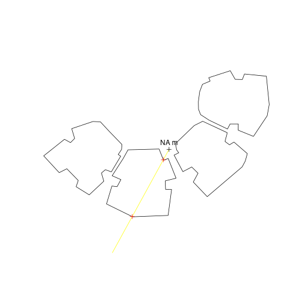
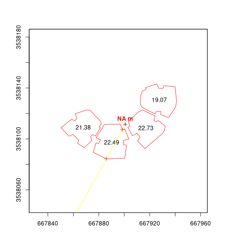

<!-- README.md is generated from README.Rmd. Please edit that file -->

[](https://cran.r-project.org/package=shadow)
[](https://cran.r-project.org/package=shadow)


### Introduction

`shadow` is an R package for geometric shadow calculations in an urban environment. A detailed description can be found in the [R Journal paper (2019)](https://journal.r-project.org/archive/2019/RJ-2019-024/RJ-2019-024.pdf):

[](https://journal.r-project.org/archive/2019/RJ-2019-024/RJ-2019-024.pdf)

### Installation

CRAN version:


``` r
install.packages("shadow")
```

GitHub version:


``` r
install.packages("remotes")
remotes::install_github("michaeldorman/shadow")
```

## Documentation

The complete documentation can be found at [https://michaeldorman.github.io/shadow/](https://michaeldorman.github.io/shadow/).

### Quick demo


``` r
library(shadow)
#> Loading required package: sp
library(raster)

# Point
location = as(sf::st_centroid(sf::st_union(sf::st_as_sf(build))), "Spatial") #rgeos::gCentroid(build)

# Time
time = as.POSIXct(
  "2004-12-24 13:30:00",
  tz = "Asia/Jerusalem"
)

# Location in geographical coordinates
proj4string(location) = CRS("EPSG:32636")
location_geo = sp::spTransform(
  location,
  CRS("EPSG:4326")
)
crs(location) = NA

# Solar position
solar_pos = suntools::solarpos( #maptools::solarpos(
  crds = location_geo,
  dateTime = time
)
solar_pos
#>          [,1]     [,2]
#> [1,] 208.7333 28.79944

# Shadow height at a single point
h = shadowHeight(
  location = location,
  obstacles = build,
  obstacles_height_field = "BLDG_HT",
  solar_pos = solar_pos
) # broken

# Result
h
#>      [,1]
#> [1,]   NA

# Visualization
sun = shadow:::.sunLocation(
  location = location,
  sun_az = solar_pos[1, 1],
  sun_elev = solar_pos[1, 2]
)
sun_ray = ray(from = location, to = sun)
build_outline = as(build, "SpatialLinesDataFrame")
inter = as(sf::st_intersection(sf::st_union(sf::st_as_sf(build_outline)), sf::st_as_sf(sun_ray)), "Spatial")# rgeos::gIntersection(build_outline, sun_ray)
plot(build)
plot(sun_ray, add = TRUE, col = "yellow")
plot(location, add = TRUE)
text(location, paste(round(h, 2), "m"), pos = 3)
plot(inter, add = TRUE, col = "red")
```



``` r

# Raster template
ext = as(extent(build)+50, "SpatialPolygons")
r = raster(ext, res = 2)

# Shadow height surface
height_surface = shadowHeight(
  location = r,
  obstacles = build,
  obstacles_height_field = "BLDG_HT",
  solar_pos = solar_pos,
  parallel = 2
) # broken

# Visualization
plot(height_surface, col = grey(seq(0.9, 0.2, -0.01)))
# height_surface NAs contour(height_surface, add = TRUE)
plot(build, add = TRUE, border = "red")
text(as(sf::st_centroid(sf::st_as_sf(build)), "Spatial"), build$BLDG_HT)#text(rgeos::gCentroid(build, byid = TRUE), build$BLDG_HT)
#> Warning: st_centroid assumes attributes are constant over geometries
text(location, paste(round(h, 2), "m"), pos = 3, col = "red", font = 2)
plot(sun_ray, add = TRUE, col = "yellow")
plot(inter, add = TRUE, col = "red")
plot(location, add = TRUE)
```




